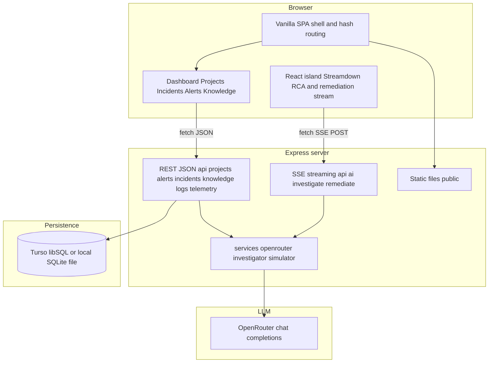
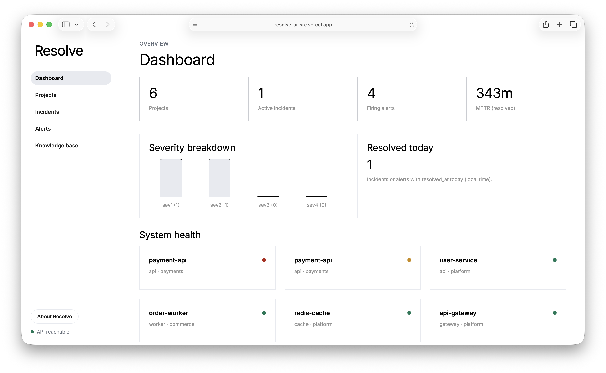
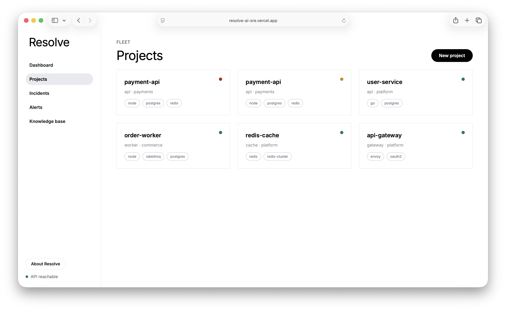
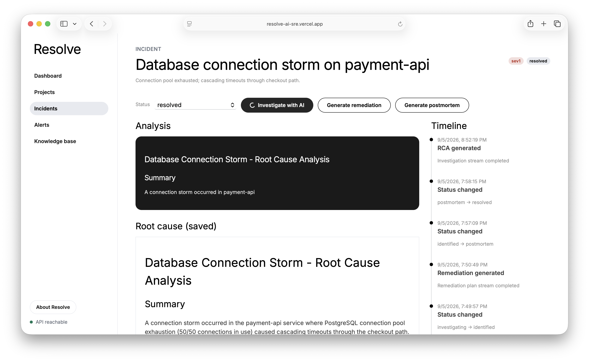
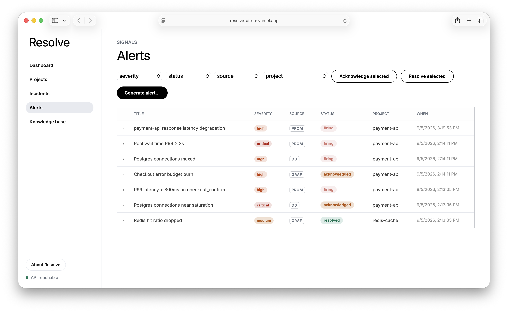
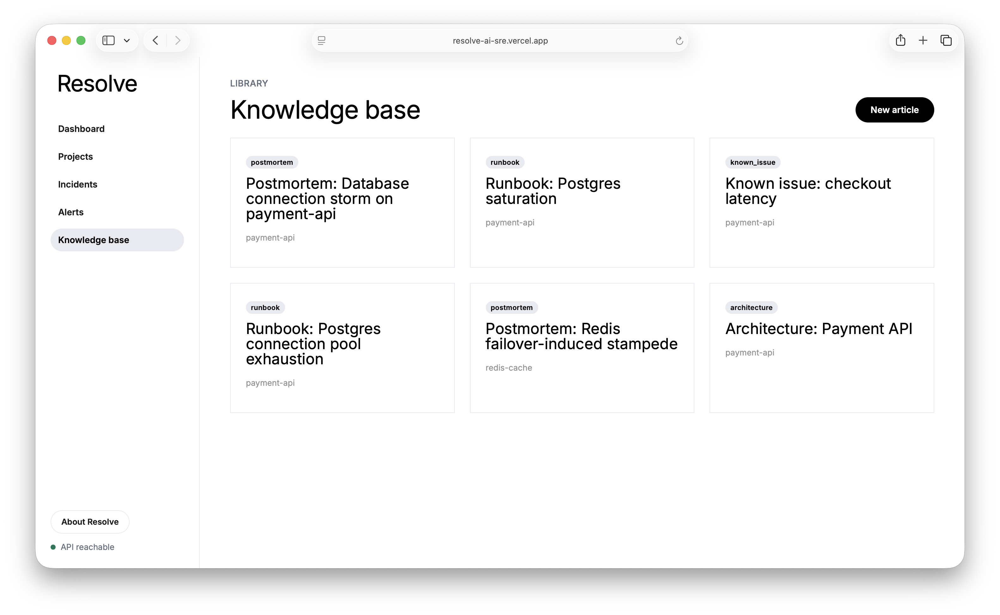
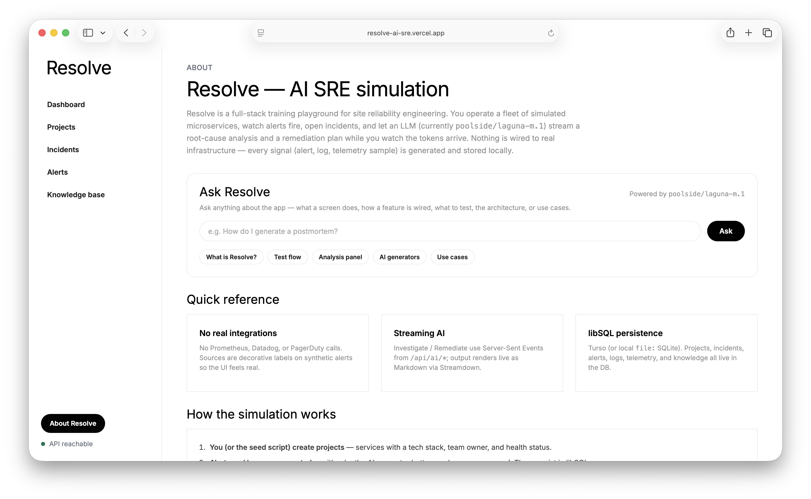

# Resolve

**Resolve** is a full-stack AI SRE simulation platform: you manage simulated microservices (projects), alerts, incidents, and logs, then use an LLM (via [OpenRouter](https://openrouter.ai/)) to stream **root cause analysis** and **remediation plans**. Live investigation output is rendered with [Streamdown](https://streamdown.ai/) for readable Markdown while tokens arrive.

There are no real integrations with Prometheus, PagerDuty, or production systems—everything is simulated data plus AI reasoning and UX.

---

## Tech stack

| Layer | Choice |
|--------|--------|
| Server | Node.js, Express |
| Database | [Turso](https://turso.tech/) (libSQL) or local SQLite via `file:` URL |
| LLM | OpenRouter API (`anthropic/claude-sonnet-4-20250514`, fallback model in code) |
| Streaming | Server-Sent Events (SSE) from OpenRouter through `/api/ai/*` |
| Frontend | Single-page shell: vanilla HTML/CSS/JS, hash routing; incident stream UI uses a small React bundle with Streamdown |
| Deploy | [Vercel](https://vercel.com/) + `api/index.js` (see `vercel.json`) |

---

## Architecture

High-level view of how the browser, API server, database, and LLM fit together.



**Flow notes:** CRUD and reads go through REST handlers that query **libSQL**. AI actions call **OpenRouter** (non-streaming for JSON alert or log generation; streaming for investigate and remediate). The incident **Analysis** panel uses a small bundled **React + Streamdown** client that consumes the SSE stream and renders Markdown live.

---

## UI reference

Screens captured from the running app, used as visual reference for the surfaces described above.

### Dashboard

Top-level overview with project/incident/alert counts, health cards, recent activity, and the **Seed scenario** entry point.



### Projects

Project cards and detail tabs (overview, related alerts, logs with level filter, telemetry, linked knowledge).



### Incidents

Incident list and detail page where **Investigate with AI**, **Generate remediation**, and **Generate postmortem** are triggered. The Analysis panel renders streamed Markdown via Streamdown.



### Alerts

Firing / acknowledged / resolved alerts with filters, **Generate alert** (AI), and bulk acknowledge/resolve actions.



### Knowledge

Knowledge base of runbooks and postmortems, including AI-generated postmortems linked back to projects.



### About

About surface describing the simulation scope and stack.



---

## Prerequisites

- **Node.js** 18+ (with `fetch` and native ES modules)
- **npm**
- **Turso** credentials *or* a local file DB (see [Environment variables](#environment-variables))
- **OpenRouter API key** for AI features (alert/log generation, investigate, remediation, postmortem)

---

## Quick start

1. **Clone and install**

   ```bash
   git clone <your-repo-url> resolve
   cd resolve
   npm install
   ```

2. **Configure environment**

   ```bash
   cp .env.example .env
   ```

   Edit `.env` (see table below). For local SQLite without Turso:

   ```bash
   TURSO_DATABASE_URL=file:./resolve-local.db
   ```

   You do **not** need `TURSO_AUTH_TOKEN` when using a `file:` URL.

3. **Build the AI streaming UI** (bundles React + Streamdown)

   ```bash
   npm run build
   ```

   `npm run dev` runs this automatically before starting the server.

4. **Seed demo data** (optional but recommended)

   ```bash
   npm run seed
   ```

5. **Run the app**

   ```bash
   npm run dev
   ```

   Default port is **3000** unless you set `PORT` (e.g. `PORT=4000 npm run dev`).

6. **Open the UI**

   In a browser: `http://localhost:3000` (or your `PORT`).

---

## Environment variables

| Variable | Required | Description |
|----------|----------|--------------|
| `OPENROUTER_API_KEY` | Yes, for AI | API key from [OpenRouter](https://openrouter.ai/) |
| `TURSO_DATABASE_URL` | Yes | Turso database URL, **or** `file:./resolve-local.db` for local SQLite |
| `TURSO_AUTH_TOKEN` | For remote Turso only | Auth token from Turso / Vercel Storage |
| `PORT` | No | HTTP port (default `3000`) |

---

## npm scripts

| Script | Purpose |
|--------|---------|
| `npm run dev` | Builds the Streamdown bundle, then starts `server.js` |
| `npm run start` | Starts `server.js` only (run `npm run build` first if the bundle is missing) |
| `npm run build` | Builds `public/js/ai-stream.bundle.js` and copies Streamdown CSS to `public/css/streamdown.css` |
| `npm run seed` | Inserts demo projects, alerts, logs, telemetry, knowledge, and one open incident |

---

## Project layout (high level)

- `server.js` — local development entry
- `api/index.js` — Vercel serverless entry (same Express app)
- `app.js` — Express app: API routes, static `public/`, SPA fallback
- `db/` — Turso client, schema init, seed script
- `routes/` — REST API for projects, alerts, incidents, knowledge, logs, telemetry, AI
- `services/` — OpenRouter client, simulator prompts, investigation context
- `public/` — `index.html`, `css/`, `js/` (including bundled AI stream)

---

## Deployment notes

- Set `OPENROUTER_API_KEY`, `TURSO_DATABASE_URL`, and `TURSO_AUTH_TOKEN` in your host’s environment (e.g. Vercel project settings).
- Run **`npm run build`** during your build step so `ai-stream.bundle.js` and `streamdown.css` exist in `public/`.
- Serverless timeouts apply to long SSE streams; see `vercel.json` and OpenRouter `max_tokens` in code if you hit limits.

---

## End-to-end flow (one complete path)

This walkthrough goes from an empty setup through **observing an incident → AI investigation → remediation → closure**. Follow the steps in order.

### Phase A — Environment and data

1. **Install dependencies** — `npm install`.
2. **Create `.env`** from `.env.example` and set:
   - `TURSO_DATABASE_URL` (Turso or `file:./resolve-local.db`)
   - `TURSO_AUTH_TOKEN` if using remote Turso
   - `OPENROUTER_API_KEY` for AI
3. **Build frontend bundles** — `npm run build` (or rely on `npm run dev` to run it).
4. **Initialize data** — `npm run seed` so you have projects, alerts, logs, telemetry, knowledge articles, and **at least one open incident** linked to alerts.
5. **Start the server** — `npm run dev`, then open the app in the browser.

### Phase B — Orient in the UI

6. **Dashboard** — Confirm stats (projects, incidents, alerts), health cards, and recent activity. Optionally use **Seed scenario** to inject a named preset (database storm, memory leak, bad deploy, cache stampede).
7. **Projects** — Open a project card; review tabs: overview-related alerts, logs (with level filter), telemetry, linked knowledge.
8. **Alerts** — See firing/acknowledged/resolved alerts; use filters; optionally **Generate alert** (AI) from the Alerts page or from a project.

### Phase C — Incident response (core demo)

9. **Incidents** — Open the seeded incident (or create one with **New incident**, tied to a project).
10. **Investigate with AI** — On the incident detail page, click **Investigate with AI**. The backend gathers incident details, linked alerts, recent logs, telemetry, and knowledge; streams the LLM response over SSE; saves **RCA** on the incident. The **Analysis** panel shows streaming Markdown via Streamdown.
11. **Generate remediation** — After RCA exists, click **Generate remediation** (same streaming pattern; saves **remediation** text).
12. **Optional: Postmortem** — **Generate postmortem** creates a Knowledge Base article from the incident context.
13. **Status workflow** — Use the **Status** dropdown to move through `investigating` → `identified` → `monitoring` → `resolved` (or `postmortem` if you treat that as the final documentation step).

### Phase D — Clean up signals

14. **Alerts** — For alerts tied to the incident, use **Acknowledge** / **Resolve** (including bulk actions on the Alerts page) so the queue reflects reality in the simulation.
15. **Knowledge** — Browse or edit runbooks/postmortems; link articles to projects where useful.

At the end of this path you have: **simulated telemetry and logs**, a **recorded RCA and remediation**, optional **postmortem in the knowledge base**, **incident status** reflecting resolution, and **alerts** moved out of “firing” where appropriate—without touching real infrastructure.

---

## Troubleshooting

- **“OPENROUTER_API_KEY is not configured”** — Add the key to `.env` and restart.
- **Database errors** — Verify `TURSO_DATABASE_URL` (and token for remote Turso). For local file DB, ensure the process can create/write the file path.
- **Analysis panel looks broken or empty** — Run `npm run build` and hard-refresh; confirm `public/js/ai-stream.bundle.js` and `public/css/streamdown.css` exist.
- **Port already in use** — Set `PORT` to another value or stop the other process using that port.

---

## License

This project is licensed under the [MIT License](LICENSE).
